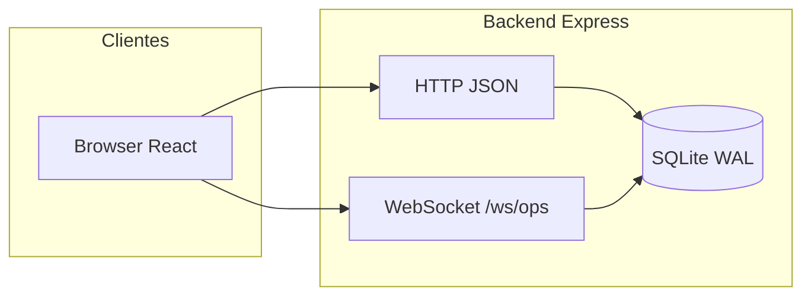
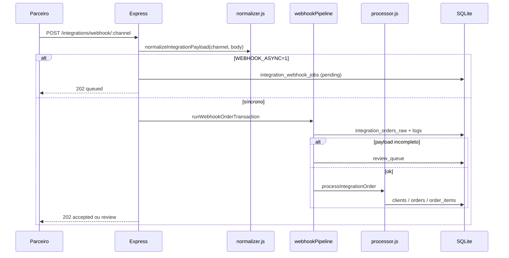

# Arquitetura Guto Express V53

Este documento descreve como o **painel operacional** (`frontend/`) e a **API** (`backend/`) se organizam, como fluem os pedidos (manual e via integração) e onde estendê-los com segurança.

## Visão geral

- **Estado operacional**: pedidos, fila de motoboys, entregas e KDS vivem no SQLite; o snapshot agregado alimenta o painel por HTTP e WebSocket.
- **Integrações**: webhooks externos chegam como JSON bruto, são normalizados e podem criar pedido interno ou ir para **fila de revisão**.
- **IA**: autopilot e insights leem o mesmo snapshot; o chat (`/ai/...`) usa serviços em `modules/ai/`.

---

## Frontend (`frontend/`)

SPA em **React** com **rotas reais** (`react-router-dom`). Cada item do menu lateral corresponde a um **módulo** sob `src/modules/<nome>/`. O contrato do menu está centralizado em `src/app/navigation.js`; as rotas em `src/app/App.jsx`.

| Menu           | Rota              | Pasta do módulo        | API principal |
|----------------|-------------------|------------------------|---------------|
| Dashboard      | `/`               | `modules/dashboard`    | `WS /ws/ops` ou `GET /ops/snapshot` |
| Command Center | `/command-center` | `modules/command-center`| idem |
| Live Ops       | `/live-ops`       | `modules/live-ops`     | idem (visão KDS) |
| Autopilot      | `/autopilot`      | `modules/autopilot`    | `GET /ai/autopilot` |
| Atendimento    | `/atendimento`    | `modules/atendimento`  | `POST /clients`, `POST /orders` |
| Pedidos        | `/pedidos`        | `modules/pedidos`      | `GET/POST /orders`, detalhe com itens |
| KDS            | `/kds`            | `modules/kds`          | `/kds`, eventos |
| Expedição      | `/expedicao`      | `modules/expedicao`    | `/dispatch`, `/drivers/queue`, `/routing/plan` |
| Motoboys       | `/motoboys`       | `modules/motoboys`     | `/drivers` |
| Integrações    | `/integracoes`    | `modules/integracoes`  | Ver secção Integrações abaixo |

### Organização transversal

| Caminho | Papel |
|---------|--------|
| `src/services/` | Clientes HTTP por domínio (`orders`, `dispatch`, etc.). |
| `src/contexts/OpsSnapshotContext.jsx` | Uma ligação WebSocket (ou fallback) partilhada; `useOpsSnapshot()`. |
| `src/layouts/` | `MainLayout` + `Outlet`. |
| `src/components/` | Sidebar, indicadores de API, peças reutilizáveis. |

### Desenvolvimento local

- **Vite** costuma expor o frontend em `http://localhost:5173`.
- **API** sobe com `npm run dev` no `backend/` (porta padrão **3210**; use `PORT=3220` se `3210` estiver ocupada).
- Para o browser falar com a API sem CORS chato, configure `server.proxy` no `vite.config.js` apontando prefixos como `/orders`, `/clients`, `/integrations`, `/ops`, `/ai`, `/menu`, `/health` para `http://localhost:3210` (ou a porta em uso).

---

## Backend (`backend/src/`)

Servidor **Express** montado em `server.js`: CORS, JSON (limite 512kb, `rawBody` disponível para assinaturas futuras), **métricas** (`/metrics`), **`/health`**, routers por domínio e **HTTP server** partilhado com **WebSocket** (`attachOpsSocketHub`).

### Módulos por pasta

| Pasta / módulo | Papel |
|----------------|--------|
| `modules/orders` | CRUD operacional de pedidos, itens, histórico de status, campos de entrega (lat/lng, endereço, bairro). `POST /orders` validado com Zod. |
| `modules/kds` | Cozinha: filas e eventos ligados a `orders`. |
| `modules/dispatch` | Expedição / vínculo pedido–motoboy (`deliveries`). |
| `modules/routing` | Plano de rota, geocodificação opcional (Google quando configurado). |
| `modules/integrations` | Canais, **webhook**, logs, **review queue**, fila assíncrona de jobs. |
| `modules/customers` | Clientes (`/clients`), chave natural frequentemente o **telefone** (único). `POST /` validado com Zod (`validation/httpSchemas.js`). |
| `modules/drivers` | Motoboys e fila (`/drivers`, `/drivers/queue`). |
| `modules/menu` | `GET /menu/items` — stub preparado para cardápio dinâmico. |
| `modules/auth` | `GET /auth/status` (evolução futura). |
| `modules/ai` | Autopilot, insights embutidos no snapshot, roteamento de chat. |
| `modules/ops` | `buildOperationalSnapshot(db)` — visão única para painel e IA. |
| `sockets/opsSocket.js` | `WS /ws/ops`: broadcast do snapshot (detalhes em `sockets/README.md`). |
| `metrics.js` | Prometheus-friendly + middleware. |
| `db.js` | SQLite, migrações leves (`ALTER` condicional), WAL, FK. |

---

## Fluxo: pedido manual (painel)

1. **Atendimento** pode criar ou reutilizar cliente via `POST /clients`.
2. `POST /orders` cria cabeçalho e histórico inicial (`novo`).
3. Itens e transições de status seguem as rotas em `modules/orders`.
4. KDS e expedição leem/atualizam o mesmo `orders` / `deliveries`.

---

## Fluxo: integrações (webhook)

Entrada: `POST /integrations/webhook/:channel` com corpo JSON do parceiro (`:channel` identifica o canal, por exemplo `ifood`).

### Endpoints úteis de integração

| Método | Caminho | Uso |
|--------|---------|-----|
| `GET` | `/integrations` | Lista canais cadastrados. |
| `POST` | `/integrations` | Cadastro manual de integração. |
| `PATCH` | `/integrations/:id` | Atualizar nome, token, segredo, ativo. |
| `POST` | `/integrations/webhook/:channel` | Entrada de pedido do parceiro. |
| `GET` | `/integrations/orders` | RAW recebidos (auditoria). |
| `GET` | `/integrations/logs` | Linha do tempo de eventos. |
| `GET` | `/integrations/review-queue` | Itens que precisam intervenção humana. |
| `POST` | `/integrations/review-queue/:id/resolve` | Promover RAW para pedido após revisão. |
| `GET` | `/integrations/webhook-jobs` | Jobs assíncronos (`WEBHOOK_ASYNC=1`). |

### Webhook: assinatura HMAC e rate limit

- Se `integrations.webhook_secret` estiver preenchido, o `POST /integrations/webhook/:channel` exige o header **`x-guto-webhook-signature`** com valor **`sha256=`** + 64 caracteres hex: HMAC-SHA256 do **corpo bruto** (os mesmos bytes do JSON recebidos; o servidor usa `req.rawBody` do `express.json` com `verify`).
- Sem segredo na integração, a verificação é omitida (compatível com ambientes de teste).
- O endpoint usa **rate limit** por IP (`express-rate-limit`), configurável via `WEBHOOK_RATE_MAX` e `WEBHOOK_RATE_WINDOW_MS`. Com reverse proxy, defina **`TRUST_PROXY=1`** para o limite usar o IP do cliente (`X-Forwarded-For`).
- Implementação: `modules/integrations/webhookSignature.js`.

### Normalização (`normalizer.js`)

Concentra variações de payload em um DTO interno: `externalOrderId`, `customer`, `items`, `total`, `delivery` (endereço, lat/lng, bairro quando existir no JSON). Novos parceiros devem ser mapeados aqui (ou aceitar formato já suportado).

### Auto-aceite vs revisão (`webhookPipeline.js`)

Para criação automática de pedido, o pipeline exige payload **com itens**, **nome do cliente** e **total** coerente; caso contrário o RAW fica em `review_queue`. Pedidos duplicados (mesmo `integration_id` + `external_order_id`) são bloqueados a nível de BD.

### Geocodificação pós-webhook

Se `WEBHOOK_GEOCODE_DELIVERY=1` e existir `GOOGLE_MAPS_API_KEY`, após aceitar o pedido pode ser preenchido lat/lng da entrega (`maybeApplyWebhookGeocode` + `routing/googleRoutes.js`).

---

## Persistência (SQLite)

Ficheiro padrão: `database.sqlite` (relativo ao cwd do processo backend). Tabelas principais:

- **Operação**: `clients`, `orders`, `order_items`, `order_status_history`, `drivers`, `driver_queue`, `deliveries`, `kds_events`.
- **Integrações**: `integrations`, `integration_orders_raw`, `integration_logs`, `review_queue`, `integration_webhook_jobs`.

Campos extra em `orders` (entrega) são adicionados por `db.js` se ainda não existirem (`delivery_lat`, `delivery_lng`, `delivery_address`, `delivery_neighborhood`).

---

## Tempo real e observabilidade

- **`GET /ops/snapshot`**: JSON completo para quem não usa WS.
- **`WS /ws/ops`**: mesma informação em push (reconexão no cliente via contexto React). Opcionalmente protegido com **`OPS_WS_TOKEN`** (query `token` na URL do upgrade; no frontend, `VITE_OPS_WS_TOKEN` com o mesmo valor).
- **`GET /health`**: sinal de vida.
- **`GET /metrics`**: métricas para Prometheus (quando integrado). Opcionalmente protegidas por `METRICS_TOKEN` (Bearer ou `?token=`).

---

## IA

| Rota | Origem dos dados |
|------|------------------|
| `GET /ai/autopilot` | Snapshot atual + regras em `decideAutopilotActions`. |
| `GET /ai/insights` | Subconjunto `snap.ai` do snapshot. |
| `GET /ai/...` (chat) | `chatRouter` + cliente OpenAI (`config/openaiEnv.js`). |

A lógica de “o que o painel mostra como inteligência operacional” está em `modules/ai/operations.js`, alimentada pelo mesmo snapshot que o resto do sistema.

---

## Variáveis de ambiente (referência)

| Variável | Efeito |
|----------|--------|
| `PORT` / `HOST` | Bind do servidor HTTP (default porta 3210). |
| `TRUST_PROXY` | `1`, `true` ou `on`: ativa `trust proxy` com 1 hop (ex.: atrás de nginx/Cloudflare). Também aceita inteiro `2`–`32` número de proxies. Sem isto, `req.ip` no rate limit de webhook pode ser o IP do proxy. |
| `METRICS_TOKEN` | Se definido (string não vazia), `GET /metrics` exige `Authorization: Bearer <token>` ou `?token=<token>` (comparação em tempo constante). Sem variável, `/metrics` permanece público. |
| `OPS_WS_TOKEN` | Se definido, o upgrade para `WS /ws/ops` exige `?token=` igual ao valor (comparação em tempo constante). No `frontend`, definir **`VITE_OPS_WS_TOKEN`** com o mesmo segredo para o painel ligar ao hub. |
| `WEBHOOK_ASYNC` | `1` / `true` / `on`: enfileira em `integration_webhook_jobs` e responde 202 com `jobId`. |
| `WEBHOOK_WORKER_POLL_MS`, `WEBHOOK_JOB_MAX_ATTEMPTS`, `WEBHOOK_WORKER_BATCH` | Afinamento do worker de jobs. |
| `WEBHOOK_GEOCODE_DELIVERY` | `1` para tentar geocodificar endereço após aceite. |
| `WEBHOOK_RATE_MAX` | Máx. de POSTs de webhook por IP por janela (default `200`). |
| `WEBHOOK_RATE_WINDOW_MS` | Janela do rate limit em ms (default `60000`). |
| `GOOGLE_MAPS_API_KEY` | Usada por roteirização / geocodificação quando configurada. |

Use `dotenv` no arranque (`import 'dotenv/config'` em `server.js`).

---

## Equipa de desenvolvimento

Onboarding, fluxo Git/CI, proxy Vite em dev e **backlog priorizado (P0/P1/P2)** para fechar o sistema: ver **[EQUIPE-DESENVOLVIMENTO.md](./EQUIPE-DESENVOLVIMENTO.md)**.

---

## Legado

A pasta `apps/admin-web/` foi substituída por `frontend/`; novas funcionalidades de UI devem ir apenas para `frontend/`.

---

## Onde evoluir a seguir

- **Cardápio**: substituir o stub de `GET /menu/items` por fonte real (ERP, JSON importado, etc.) e manter o contrato estável para o atendimento.
- **Integrações**: novos `channel` e formatos de payload → estender `normalizer.js` e testes de webhook; com `webhook_secret` definido, lembrar de enviar `x-guto-webhook-signature` nos testes (HMAC do body).
- **Auth**: consolidar `modules/auth` com sessão/JWT e proteger rotas sensíveis.
